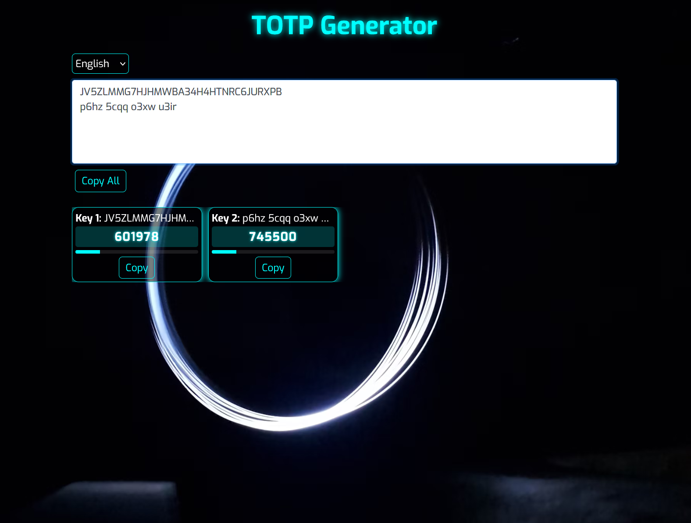

# TOTP Generator | TOTP生成器

[English](#english) | [中文](#中文)

## English

A web-based TOTP (Time-based One-Time Password) generator that supports multiple keys and provides real-time code generation. Built with Flask and modern web technologies.

### Features

- Support for multiple TOTP keys simultaneously
- Real-time code generation with countdown timer
- Copy individual codes or all codes at once
- Multi-language support (EN, 中文, FR, DE, ES, 日本語, 한국어)
- Beautiful and responsive UI design
- Secure client-side operation

### Demo

Try it online: [https://totp.ks0.cc](https://totp.ks0.cc)

### Installation

1. Clone the repository
2. Install dependencies: `pip install -r requirements.txt`
3. Run the application: `python app.py`
4. Visit `http://localhost:5000` in your browser

## 中文

一个基于Web的TOTP（基于时间的一次性密码）生成器，支持多个密钥并提供实时代码生成。使用Flask和现代Web技术构建。

### 特性

- 同时支持多个TOTP密钥
- 实时代码生成，带倒计时显示
- 支持复制单个或所有验证码
- 多语言支持（英文、中文、法文、德文、西班牙文、日文、韩文）
- 美观且响应式的界面设计
- 安全的客户端运算

### 在线演示

在线体验：[https://totp.ks0.cc](https://totp.ks0.cc)

### 安装方法

1. 克隆仓库
2. 安装依赖：`pip install -r requirements.txt`
3. 运行应用：`python app.py`
4. 在浏览器中访问 `http://localhost:5000`

## License

MIT License